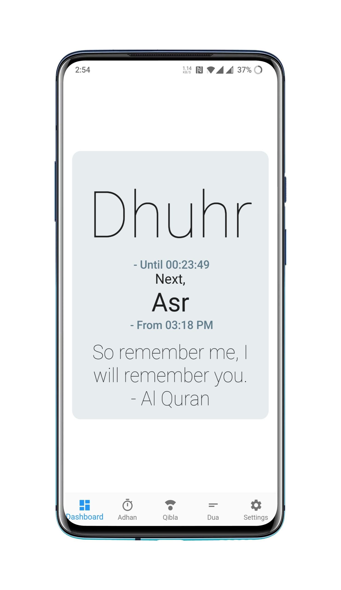
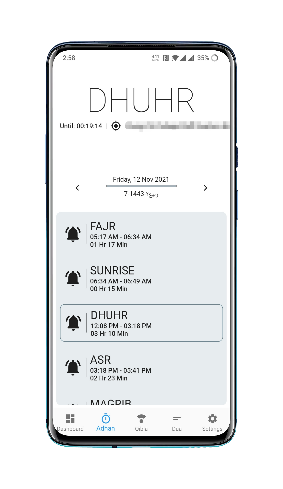
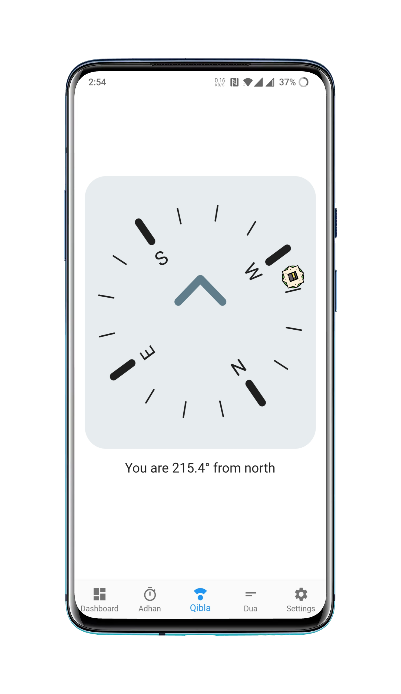
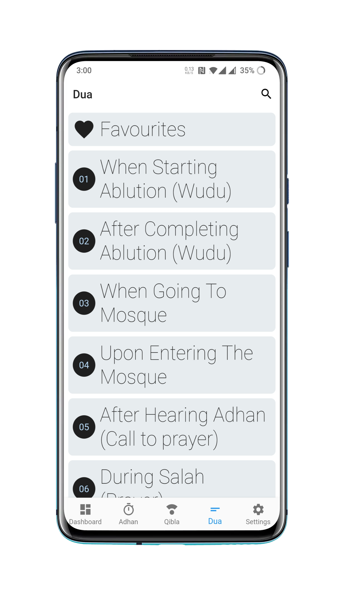
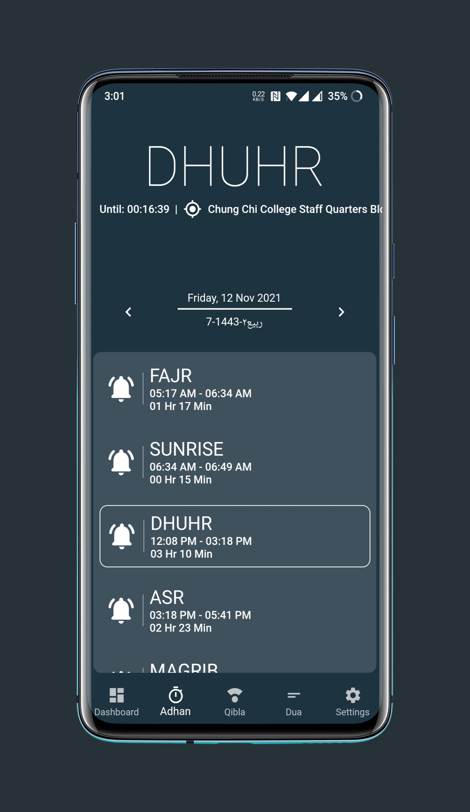
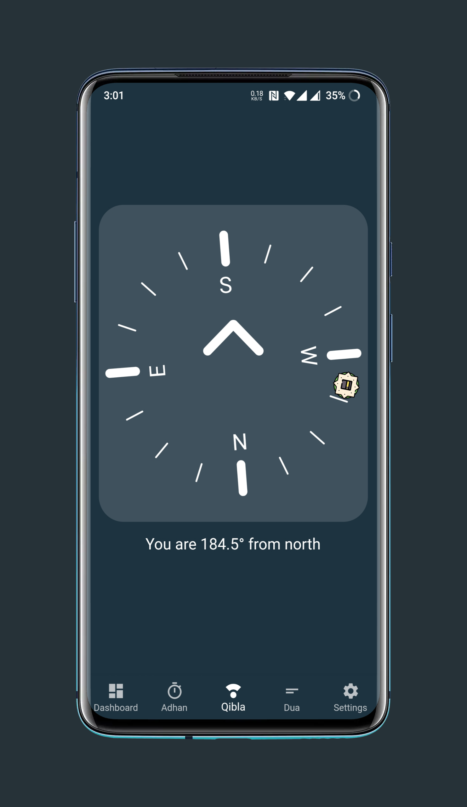
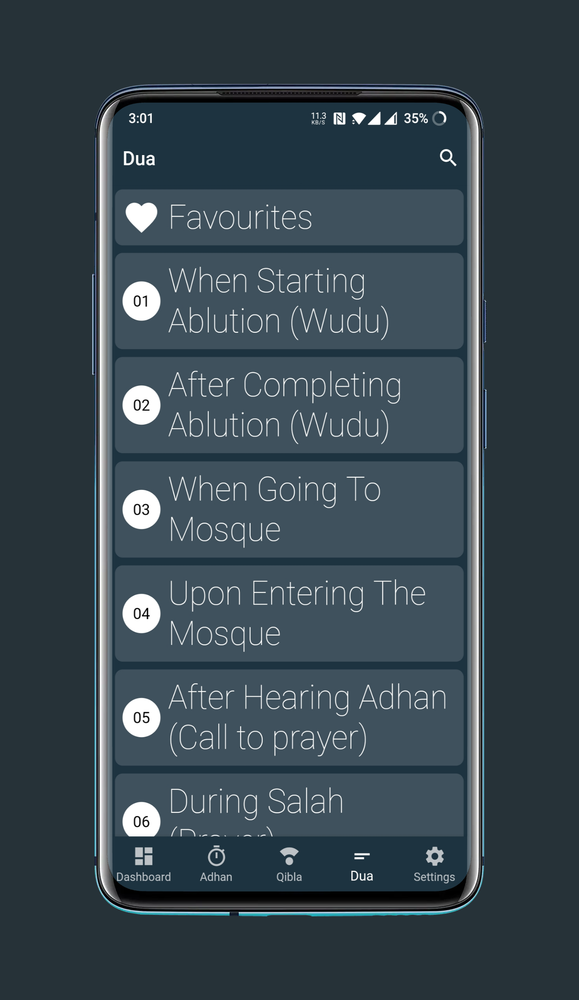

# Minimal Adhan

 

 
An Open-Sourced Adhan app for the ummah. 
<b> Built With FLutter </b>

<table>
  <tr>
    <td></td>
    <td></td>
    <td></td>
    <td></td>
  </tr>
  
  <tr>
    <td></td>
    <td></td>
    <td></td>
    <td></td>
  </tr>
</table>

## Features
<ul>
  <li><h3> Zero Data Collection Without users concern </h3></li>
  <li> 
    Multiple language support 
    <ul>
      <li> <a href = "https://github.com/MuhammadFahidSarker/minimal_adhan/blob/master/lib/localization/langs/app_en.arb" > English </a></li>
      <li> <a href = "https://github.com/MuhammadFahidSarker/minimal_adhan/blob/master/lib/localization/langs/app_ar.arb" > Arabic </a></li>
      <li> <a href = "https://github.com/MuhammadFahidSarker/minimal_adhan/blob/master/lib/localization/langs/app_bn.arb" > Bangla </a></li>
      <li> Your contribution ❤️ </li>
    </ul>
  </li>
  <li>
    <b>Adhan Timings:</b>
    <ul>
      <li>5 Prayer Times </li>
      <li>Sunrise Time</li>
      <li>Midnight Time (For Qiam-ul-layl)</li>
      <li>Last Third of night Time (For Qiam-ul-layl)</li>
    </ul>
  </li>
  <li> Qibla Direction and compass </li>
  <li> Essential Duas with translations and transliteration in multiple languages </li>
  <li> 
    Able to configure adhan time calculation parameters 
    <ul>
      <li> Calculation methods </li>
      <li> Madhab (School of thoughts) </li>
      <li> High Latitude rules </li>
      <li> Adhan Visibility </li>
      <li> Manual Corrections </li>
      <li><a href = "https://github.com/iamriajul/adhan-dart"> See More </a> </li>
    </ul>
  </li>
  <li> Adhan Notification 
    <ul>
      <li>On Time Notification</li>
      <li>Persistent Notification</li>
    </ul>
  </li>
</ul>

## Development
<ul>
  <li>
    Dependencies:
    <ul>
      <li> <a href="https://pub.dev/packages/adhan/versions/" > adhan </a> </li>
      <li> <a href = "https://pub.dev/packages/geolocator/versions/" > geolocator </a></li>
      <li> <a href = "https://pub.dev/packages/intl/versions/" > intl </a></li>
      <li> <a href = "https://pub.dev/packages/auto_size_text/versions/" > auto_size_text </a></li>
      <li> <a href = "https://pub.dev/packages/webview_flutter" > webview_flutter </a></li>
      <li> <a href = "https://pub.dev/packages/provider/versions/" > provider </a></li>
      <li> <a href = "https://pub.dev/packages/hijri/versions" > hijri </a></li>
      <li> <a href = "https://pub.dev/packages/geocoding" > geocoding </a></li>
      <li> <a href = "https://pub.dev/packages/shared_preferences" > shared_preferences </a></li>
      <li> <a href = "https://pub.dev/packages/flutter_compass/versions/" > flutter_compass </a></li>
      <li> <a href = "https://pub.dev/packages/flutter_svg" > flutter_svg </a></li>
      <li> <a href = "https://pub.dev/packages/lottie" > lottie </a></li>
      <li> <a href = "https://pub.dev/packages/sqflite/versions" > sqflite </a></li>
      <li> <a href = "https://pub.dev/packages/scrollable_positioned_list/versions/" > scrollable_positioned_list </a></li>
      <li> <a href = "https://pub.dev/packages/package_info_plus/versions/" > package_info_plus </a></li>
      <li> <a href = "https://pub.dev/packages/android_alarm_manager_plus" > android_alarm_manager_plus </a></li>
      <li> <a href = "https://pub.dev/packages/flutter_local_notifications" > flutter_local_notifications </a></li>
      </ul>
  </li>
</u>
  

## Lisence
<a href = "https://www.gnu.org/licenses/gpl-3.0.en.html"> GNU GPL V3 </a>

Full readme would be available as soon as the project hits alpha stage.
